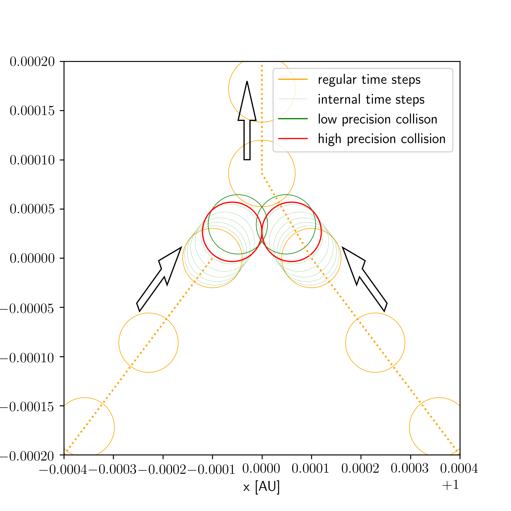
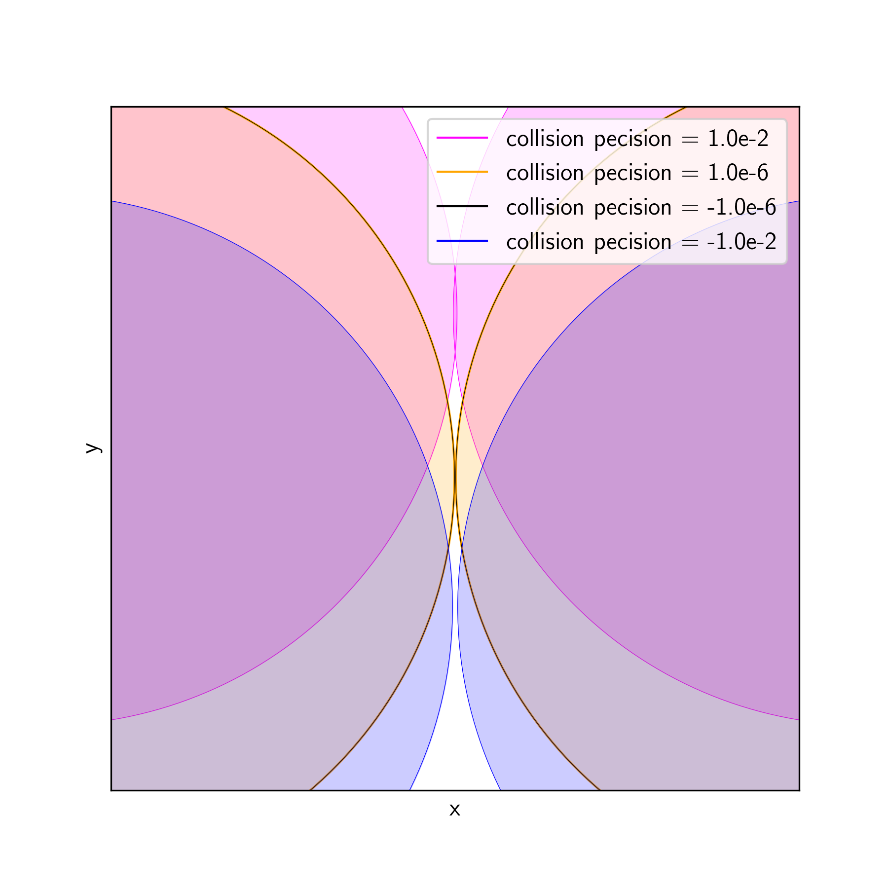
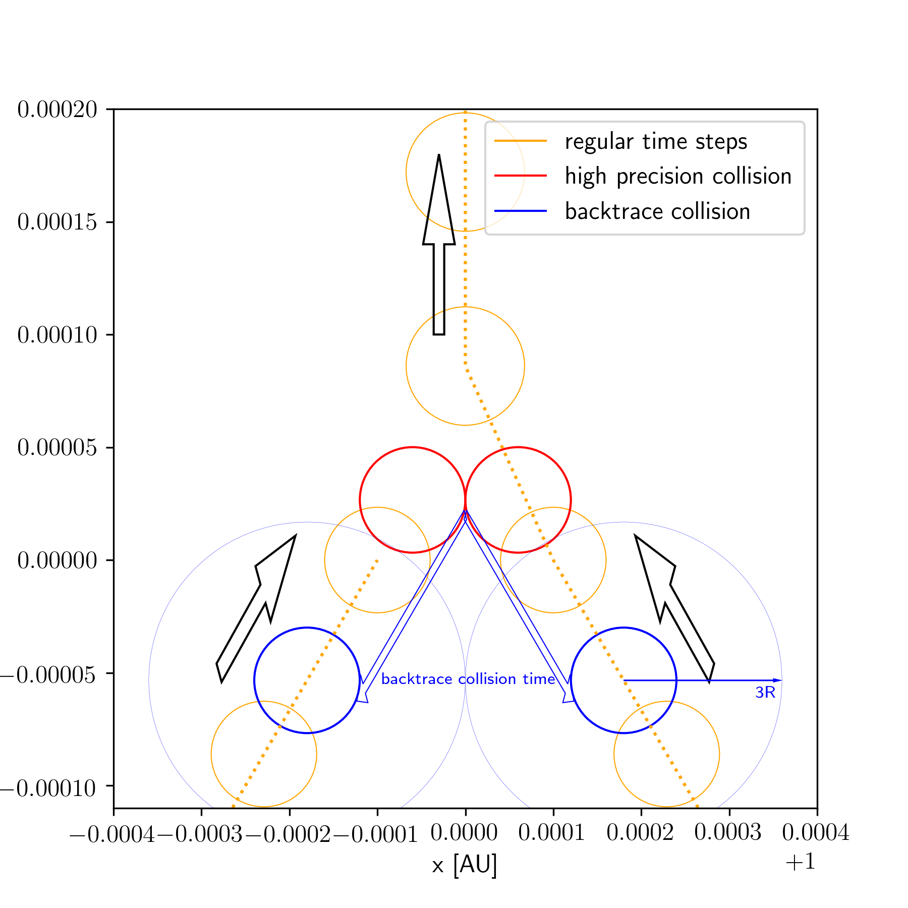

.. _Collisions:

Collisions
==========

A collision between two particles happens when the separation :math:`r_{ij}` between two bodies :math:`i` and :math:`j`
gets smaller than (or close to) the sum of their physical radii :math:`R_i + R_j`. The current version of GENGA treats collisions as
perfect inelastic mergers by forming one single bigger body. During this collision process, linear momentum is conserved.
Physically, a part of the potential and kinetic energy is transformed into an internal energy. GENGA keeps track of this
internal energy :math:`U`, such that the overall energy of the system is conserved.
Angular momentum is conserved by transferring the angular momentum of the two bodies into the spin of the new body.

The :literal:`Collision Model` option can be used to implement a different collision model than perfect merger. This can be done
int the :literal:`collide` function in the file :literal:`directAcc.h`.

When a collision happens, the coordinates of the two involved bodies are reported in the collision file (see :ref:`CollisionsFile`).

| The following parameters are relevant for the collision handling and can be set in the :ref:`param.dat<ParamFile>` file:

- :literal:`Collision Precision` in units of a physical radius fraction. (default :math:`1.0^{-4}`)
- :literal:`Collision Time Shift`, in units of a physical radius factor. (default :math:`1.0`)
- :literal:`Stop at Collision`, flag to stop simulations at the first collision time (default 0)
- :literal:`Stop Minimum Mass`, used for :ref:`StopAtCollision`, (default :math:`0`).
- :literal:`Collision Model`, can be used to implement a different collision model. The default (0) is used for a perfect merger collision.

| Relevant parameters in the :ref:`define.h<Define>` file are:

- :literal:`def_MaxColl`

Collision details
-----------------

The position and velocity of the new body is calculated as

.. math::
 
   \mathbf{x}_{\rm new} = \frac{\mathbf{x}_i m_i + \mathbf{x}_j m_j}{m_i + m_j}

   \mathbf{v}_{\rm new} = \frac{\mathbf{v}_i m_i + \mathbf{v}_j m_j}{m_i + m_j}

The spin :math:`\mathbf{S}` of the new body is calculated as

.. math::

   \mathbf{L}_{ij} = \frac{m_i m_j}{m_i + m_j} \left( \mathbf{r}_{ij} \times \mathbf{v}_{ij} \right)

   \mathbf{S}_{\rm new} = \mathbf{S}_i + \mathbf{S}_j + \mathbf{L}_{ij}

In order to keep track of the energy conservation, we add the lost kinetic and potential energy from collisions,
ejections and caused by the gas drag into a quantity :math:`U`. This quantity includes the energy loss from all particles
together and not from single particles. :math:`U` is not directly related to a physical quantity, however it contains the
change of the inner energy of all particles and the spin energy caused at collision. 

When two particles :math:`i` and :math:`j` collide, then :math:`U` is increased by

.. math::

   U = \frac{1}{2} \frac{m_i m_j}{m_i + m_j} v_{ij}^2 - G \frac{m_i m_j}{r_{ij}}

The radius :math:`R` of the new particle is set by conserving the mass and by mixing the densities of the
two particles. 

.. math:: 

   R_{\rm new} = \left( R_i^3 + R_j^3 \right)^{1/3}

The index of the next body is calculated according to the rules:

 - The index of the more massive body.
 - If both bodies have an equal mass, then take the smaller index of the bodies :math:`i` and :math:`j`

The moment of inertia :math:`Ic` of the new body is calculated as

.. math::

   Ic_{\rm new} = \frac{m_i Ic_i + m_j Ic_j}{m_i + m_j}

The potential love number :math:`k2` of the new body is calculated as

.. math::

   k2_{\rm new} = \frac{m_i k2_i + m_j k2_j}{m_i + m_j}

The fluid love number :math:`k2f` of the new body is calculated as

.. math::

   k2f_{\rm new} = \frac{m_i k2f_i + m_j k2f_j}{m_i + m_j}

The time lag :math:`\tau` of the new body is calculated as

.. math::

   \tau_{\rm new} = \frac{m_i \tau_i + m_j \tau_j}{m_i + m_j}

At the end of the collision process, the body :math:`i` is transferred to be the new body, and body :math:`j`
is marked as a ghost particle, which is then removed from the simulation later.

Collisions can happen only during a close encounter process, and are called during the Bulirsh-Stoer integration.
The implementation of the collision can be found in the :literal:`collide` function in the :literal:`directAcc.h` file.

.. _CollisionPrecision:

Collision precision
-------------------

The collision process is resolved during the Bulirsh-Stoer direct integration with discrete time steps. Therefore, a collision is 
generally not detected at the exact collision time, but rather when the two particles already overlap by a small amount. 
Using :literal:`Collision Precision = 1.0`, GENGA uses the coordinate from the Bulirsh-Stoer step when the collision is first detected. 
This must be considered when using the data from the collision file or also directly within the code for further analysis.

Using :literal:`Collision Precision < 1.0`, GENGA refines the collision time to :math:`\frac{(R_i + R_j) - r_{ij}}{R_i + R_j} < precision`,
where :math:`r_{ij}` the separation between the two bodies and :math:`R` the physical radius. In this way the reported coordinates
from the collision slightly overlap. 

  - :math:`precision` > 0: particles overlap slightly, :math:`r_{ij} < Ri + Rj`, :math:`r_{ij} > (Ri + Rj) \cdot (1 - precision)`

Using a negative value for :literal:`Collision Precision < 1.0`, the reported coordinates at collision are not overlapping, the distance
between the two particles is slightly larger then the sum of the two radii. 

  - :math:`precision` < 0: particles do not overlap, :math:`r_{ij} > Ri + Rj`, :math:`r_{ij} < (Ri + Rj) \cdot (1 + precision)`

The precision should not be set smaller than :math:`1.0^{-10}`.
When the exact time of a collision is important, a value of around :math:`1^{-4}` is recommended.
Note that this parameter causes some more iterations in the Bulirsh-Stoer routine and can slightly increase the run time
of a simulation.

In :numref:`figCollision` is shown an example of the influence of the collision precision, and in :numref:`figCollisionZoom` is shown a 
zoomed region with different :literal:`Collision Precision` values. 

   Collision and merging of two bodies. In orange are shown the regular time steps before and after the collision. In thin green are shown
   the internal time steps of the Bulirsh-Stoer close encounter integration. A collision is reported when the two bodies already overlap (green color).
   By using a high collision precision, the collision located is resolved at the exact contact time (red color). 

   Collision position of different :literal:`Collision Precision` values. A positive value leads to slightly overlapping bodies. With a
   negative value, the bodies do not overlap, and the collision is reported slightly before the bodies really touch.  

.. _CollisionTshift:

Backtrace Collisions (TShift)
-----------------------------

The :literal:`Collision Time Shift` argument allows to backtrace a detected collision to a time prior to the real collision time, when the
two bodies were separated by a factor :math:`f` times their physical radii. The factor :math:`f` is set by 
:literal:`Collision Time Shift`. This option is especially useful when more complex collision models than perfect mergers are used.
Backtraced collisions are only calculated when the involved bodies really will collide. If they will miss a collision and undergo
a close flyby, then this option is not activated. This option can be combined with the :literal:`Collision Precision` option. 

This option is only activated for bodies with a mass larger than :literal:`Stop Minimum Mass`. 

Since multiple collisions can occur at a similar time, the backtrace option has to resolve every collision isolated. This can result
in a longer run time of the code. Especially when many collisions occur. 

| Backtraced collisions are reported in the file :ref:`CollisionsTshiftFile`.

In :numref:`figCollision3` is shown an example of a backtraced collision.  

   The real collision (in red color) is backtraced until the time when the two bodies are separated by a factor :math:`f` times the sum of their 
   physical radii. In this example, we use :math:`f = 3`. The location of the backtraced collision is shown is blue color. 

.. _StopAtCollision:

Stop at Collision
-----------------

The :literal:`Stop at Collision` option allows to stop a simulation at the time when the first collision occurs. With this option enabled,
GENGA integrates all bodies in the simulation to the exact -or backtraced - collision time. Since the time of the first collision does not
correspond in general with an output time, GENGA creates a separate output file with the coordinates of all particles at the time of the first
collision. See :ref:`OutCollisionFile`. This option is useful when collisions between bodies are resolved with an external code. Then GENGA can
be stopped when (or before) a collision happens, the collision resolved externally, and finally GENGA restarted again. 

| A simulation is only stopped at a collision when **both** involved particles have a mass larger than :literal:`Stop Minimum Mass` (default 0).
