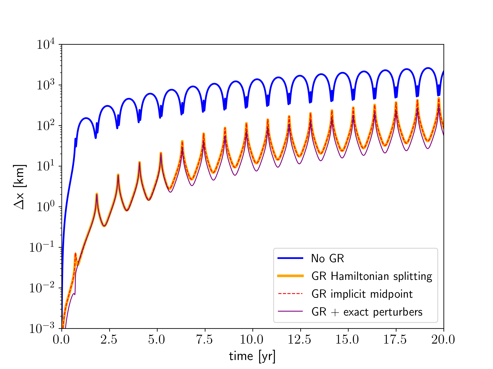

.. _GR:

General Relativity Corrections
==============================

General Relativity corrections can be enabled with the :literal:`Use GR` parameter in the :literal:`param.dat` file.
Three different methods of GR corrections are available: 

 - Hamiltonian Splitting
 - Implicit midpoint 
 - Direct force

Hamiltonian splitting (UseGR = 1)
---------------------------------

The Hamiltonian splitting method is implemented according to  :cite:p:`SahaTremaine1994`.
The GR (or also called post Newtonian) Hamiltonian takes the form:

.. math::
   :label: eq_GR1

    H_{PN} = \sum_i \left( \alpha_i H_{Kep,i}^2 + \frac{\beta_i}{r^2_i} + \gamma_i p^4_i \right)

with 

.. math::

   \alpha_i = \frac{3}{2m_i c^2}, \\

   \beta_i = \frac{-\mu_i^2 m_i}{c^2}, \\

   \gamma_i = -\frac{1}{2m_i^3 c^2}, \\

   \mu_i = G(M_\star + m_i),

and the speed of light c.

Following :cite:p:`SahaTremaine1994`, the :math:`\gamma` term is expressed as

.. math::

    d \mathbf{x}_i = -dt \cdot 2 \frac{v^2_i}{c^2} \mathbf{v}_i,

with the time step :math:`dt`. This term is combined with the Sun-kick term.

The :math:`\beta` term can be expressed as

.. math::

    d \mathbf{v}_i = -dt \cdot 2 \frac{\mu^ 2}{c^2 r^4_i} \mathbf{r}_i,

and is combined with the Kick operation, but not affected by the changeover function. 

The :math:`\alpha` term is implemented through a time step modification in the particle drift operation
(and also the close encounter direct integrator):

.. math:: 

    dt_i' = dt \cdot \left( 1 - \frac{3}{2} \frac{\mu}{a_i c^ 2}\right).

To apply the described GR Hamiltonian splitting, the velocities must be converted into pseudovelocities. 
Since GENGA allows the use of other non-Newtonian forces, which also can depend on the velocities,
we need to compute those terms in real velocities and not pseudovelocities. Therefore we convert at each
time step from real velocities to pseudovelocites and back. Only the Sun-kick and the drift operation
is done in pseudovelocities. 

Implicit Midpoint (UseGR = 2)
-----------------------------

The acceleration of the GR (post-Newtonian) effect can be approximated following
:cite:p:`Kidder1995` :cite:p:`MardlingLin2002` or :cite:p:`Fabrycky2010` as:

.. math::
   :label: eq_apn

    \mathbf{a}_{PN} = -\frac{G(M_{\star} + m_i)}{r^2_i c^2} \cdot 
    \bigg\{ -2(2 - \eta) \dot{r}_i \dot{\mathbf{r}_i}  \\ 
    + \left[ (1 + 3 \eta) \dot{\mathbf{r}}_i \cdot \dot{\mathbf{r}}_i - \frac{3}{2} \eta \dot{r}^2_i - 2(2+\eta) \frac{G(M_{\star} + m_i)}{r_i}\right] \mathbf{\hat{r}}\bigg\} , 

where :math:`c` is the speed of light and :math:`\eta` is defined as:

.. math::

    \eta = \frac{M_{\star}m_i}{(M_{\star} + m_i)^2}.

Since the equation :eq:`eq_apn` depends on the positions and the velocities, the GR corrections must by
applied with the implicit midpoint method. In that way the symplectic nature of the integration is conserved.

Direct Force (UseGR = 3)
------------------------

It is also possible to apply the equation :eq:`eq_apn` without the implicit midpoint method. But then the
integration is not fully symplectic and the semi-major of the affected bodies is not constant.
Therefore this mode is mainly for testing and for comparisons. 

Test and comparison
-------------------

A good object to test the general relativity effect is the asteroid (1566) Icarus. It has an orbital eccentricity
of 0.83 which leads to a closed approach to the Sun of about 0.2 AU. In order to test the orbit or Icarus, we 
integrate it together with the 16 most massive objects of the Solar System. All data are taken from the JPL HORIZON
system. We compare our integration with the measured orbit of Icarus. The results are shown in :numref:`figGRdiff`.
One can clearly see how the GR corrections improve the orbital positions during the first few orbital periods.
Comparing the Hamiltonian splitting approach with the implicit midpoint method leads to no significant difference.
The integration precision can be improved, when the 16 perturber objects are not integrated, but rather interpolated
from the known ephemeris. The remaining difference in the orbital position after applying the GR corrections is most
likely caused by other non-gravitational effects. Or also small deviations in the initial conditions get increased at
each orbit. 

    Difference in position of the asteroid (1566) Icarus between the integration and the measured orbit. The Asteroid Icarus
    is integrated together with the 16 most massive objects of the Solar System. When GR corrections are not considered 
    (blue line) then the position after two orbital periods differs by more than 100 km. With GR effects enabled, the
    difference is less than two km. There is not significant difference between the Hamiltonian splitting approach
    (orange line)  and the implicit midpoint method (red dashed line). When the position of the 16 perturbers is not
    integrated, but interpolated from their measured positions, then the difference in position is reduced further
    (purple line). 

