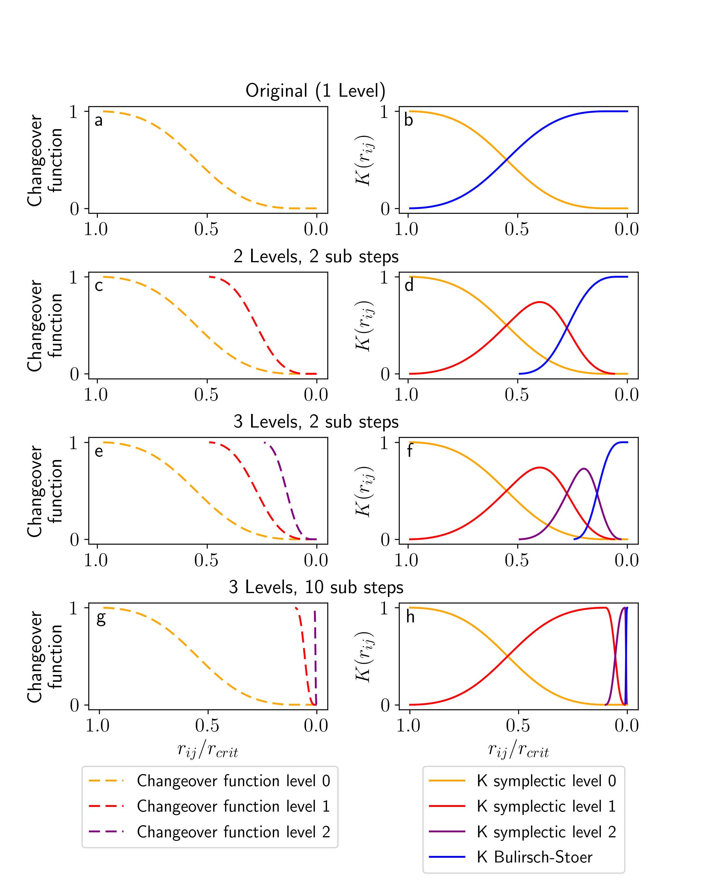

Integrator
==========

GENGA is using a hybrid symplectic integrator :cite:p:`Chambers99`.

The hybrid symplectic method uses a smooth changeover function to transfer the calculation of close encounters from the symplectic to a direct N-body
integrator like the Bulirsch-Stoer method or something similar. This transition must be applied smoothly enough to prevent from too large energy errors.
Therefore a critical radius must be defined to set a threshold between the close encounter phase andt he normal integration phase, and it must be chosen
large enough to ensure a smooth transition.

By using democratic coordinates, the Hamiltonian of a planetary system can be split into three parts:

.. math::
	H = H_{A} + H_{B} + H_{C},

with 

.. math::
	H_{A} = \sum_{i=1}^{N} \left( \frac{p_{i}^{2}}{2m_{i}}  - \frac{G m_{i} m_{\star}}{r_{i\star}} \right) \nonumber \\
	- \sum_{i = 1}^{N} \sum_{j = i+1}^{N} \frac{G m_{i} m_{j}}{r_{ij}} [ 1 - K(r_{ij})],

.. math:: 
	H_{B} = -\sum_{i = 1}^{N}\sum_{j=i +1}^{N} \frac{G m_{i} m_{j} }{r_{ij}} K(r_{ij})

and

.. math::
	H_{C} = \frac{1}{2m_{\star}}\left( \sum _{i =1} ^{N} \mathbf{p}_{i} \right) ^{2},

where the symbol :math:`\star` refers to the central mass, and :math:`K(r_{ij})` is a smooth changeover function ranging from 0 to 1.
The tree parts :math:`H_A`, :math:`H_B` and :math:`H_C` correspond to the Keplerian part, the interaction part and the Sun part of the Hamiltonian,
respectively. 

The limit where the changeover functions is applied is defined by a critical radius :math:`r_{\text{crit}}` of a particle :math:`i`:

.. math:: 
	r_{\text{crit},i}= \max(n1 \cdot R_{H,i}, n2 \cdot dt \cdot v_i).
	:label: eq_rcrit

It depends on two terms, the first contains the Hill radius :math:`R_H`, the second contains the time step :math:`dt` and the velocity :math:`v`
of the particle :math:`i`. The two parameters :math:`n1` and :math:`n2` are typically set to 3 and 0.4.

The integrator needs to search for close encounter pairs at each time step and to sort them into independent close encounter groups.
These groups are then integrated with the Bulirsch-Stoer direct N-body method. Ideally, the close encounter groups consist of only a single pair of bodies,
but it can happen that bodies have multiple close encounter pairs, which need to be linked together in a bigger close encounter group.
In the worst scenario, all bodies are in a close encounter with some neighboring bodies, and all of them are linked together into a single giant
close encounter group. This scenario is likely to happen, when the particle number density is increased for high resolution scenarios.

.. _n1n2:

The n1 and n2 values
--------------------
The values :literal:`n1` and :literal:`n2` from equation :eq:`eq_rcrit` can be set in the :ref:`param.dat<ParamFile>` file.
Typical values are n1 = 3.0 and n2 = 0.4.

.. _Symplecicorder:

The order of the symplectic integrator
--------------------------------------

The order of the symplectic integrator can be set with the :literal:`Order of integrator` parameter in the :ref:`param.dat<ParamFile>` file.
Options are 2, 4 or 6. 

The 4th and 6th order symplectic integrators use the description of :cite:p:`Yoshida1990`.

The higher order integrators work the best for cases with few close encounters. 

.. _precheck: 

Finding close encounter candidates
----------------------------------
During the force calculation, the distance of all pairs of bodies are calculated. During this step, close encounter candidates
are reported to a list when the mutual distance is smaller then the critical radius:

.. math::

	r_{ij}^2 < \text{pc} \, r_{\text{crit}}^2.

The factor :literal:`pc` is a safety factor. It can be set in the :ref:`define.h<Define>` file (default = 3.0). 

After all close encounter candidates are found. The real minimal distance between the particles is calculated, by interpolating between the
time steps. Close encounters are reported when:

.. math::

	r_{ij, min}^2 < \text{cef} \, r_{\text{crit}}^2.

The factor :literal:`cef` is a safety factor. It can be set in the :ref:`define.h<Define>` file (default = 1.0). 

.. _precheck_small: 

Finding close encounter candidates between test particles
---------------------------------------------------------
When encounter events between test particles and other test particles should be reported, then another function call is needed to find them,
because the distance between test particles is not calculated in the gravitational force evaluation. 
When the number of test particles is :math:`\lessapprox 10'000` then an :math:`N^2` algorithm can be used, where each test particle checks its
distance to every other test particle and reports close encounter candidates. But when the number of test particles gets larger, then this approach
gets very inefficient. In that case a Bounding Volume Hierarchy (BVH) tree method is used to check all potential close encounter candidates. 

.. _Close_Encounters:

Close Encounters Pairs
----------------------

The :literal:`Maximum encounter pairs` parameter in the :ref:`param.dat<ParamFile>` file, sets the amount of memory that is allocated to store close
encounter pairs of each body. When a body has more close encounters that specified here, then the simulation is stopped and an error massa is
written. Setting a larger value of :literal:`Maximum encounter pairs` increases the memory usage of the code. 

.. _SLevels:

Higher level changeover functions
---------------------------------
The :literal:`Symplectic recursion levels` and the :literal:`Symplectic recursion sub steps` parameters in the :ref:`param.dat<ParamFile>` file can be
uses to enable higher order changeover functions. :literal:`Symplectic recursion levels = 1` corresponds to the original hybrid symplectic integration
method, where forces between close encounter pairs get smoothly moved from the symplectic integrator into the direct Bulirsch-Stoer method. The higher
level changeover functions define more levels in between. In the second level, the time step gets reduced in into :literal:`Symplectic recursion sub steps`
sub steps but still integrated with a symplectic integrator. The highest level is then the Bulirsch-Stoer integrator. 

Since the higher level changeover function requires more memory to store the close encounter pairs, not more than :literal:`Symplectic recursion levels = 3`
should be used. However if more levels than three are needed, then the :literal:`def_SLevelsMax` parameter in the :ref:`define.h<Define>` file must be 
adjusted.
Typical values for :literal:`Symplectic recursion sub steps` are 2,4,8 or 10. A good strategy to set an optimal choice of parameter is to increase the number
of levels and sub steps until no more than :math:`\sim` 512 close encounter pairs are reported in the info file.  

By using the option :literal:`Symplectic recursion levels = -1`, a self tuning routine is called before the start of the integration, to find the fastest
option by itself. 

In Figure :numref:`figSLevels` are shown some examples of higher order changeover functions.

    Panels a and b: Original hybrid symplectic method: a changeover function switches smoothly from K symplectic to K Bulirsch-Stoer.
    Panels c and d: A second changeover function is included. The basic symplectic step is divided in the first level into two sub steps.
    The second level is the Bulirsch-Stoer method.
    Panels e and f: Two additional changeover functions are included for a three level scheme with each two sub steps.
    Panels g and h: Two additional changeover functions are included for a three level scheme with each ten sub steps.
