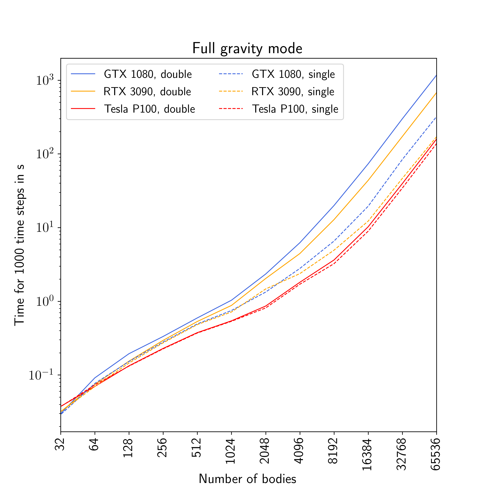

.. _KickFloat:
 
Use single precision in kick forces
===================================

By default, GENGA uses double precision variables to integrate all particles.
But GENGA offers the option to use single precision variables in the calculation of the gravitational force
between the particles. This is particular interesting because non Tesla GPUs are much faster in calculating 
single precision than double precision operations. For large N simulations, the calculation of the :math:`N^2`
gravitational force terms are often the dominant part. Therefore reducing the precision in these terms can
give a significant speed up in the simulations. However, one must be sure that the reduced precision is still
good enough to perform the given simulation. 

In detail it is the acceleration of particle j on particle i, that can be calculated either in double or 
in single precision: 

.. math::

	\mathbf{a}_{ij} = \frac{G m_j}{r_{ij}^3} \mathbf{r}_{ij} \times K(r_{ij}),

Where :math:`K(r_{ij})` is the changeover function. Note that during a close encounter, the forces in the
Bulirsch-Stoer integration are always computed in double precision.

In :numref:`figKickFloat` is shown a speed comparison between single precision and double precision for
different GPU types.

The use single precision in the gravitational forces instead of double precision, the :literal:`Do Kick in single precision`
option in the :literal:`param.dat` file must be set to 1.

This option is not yet supported in the multi simulation mode.

   Performance comparison between double precision and single precision force calculations.
   Especially non-Tesla cards can run much faster in single precision.

