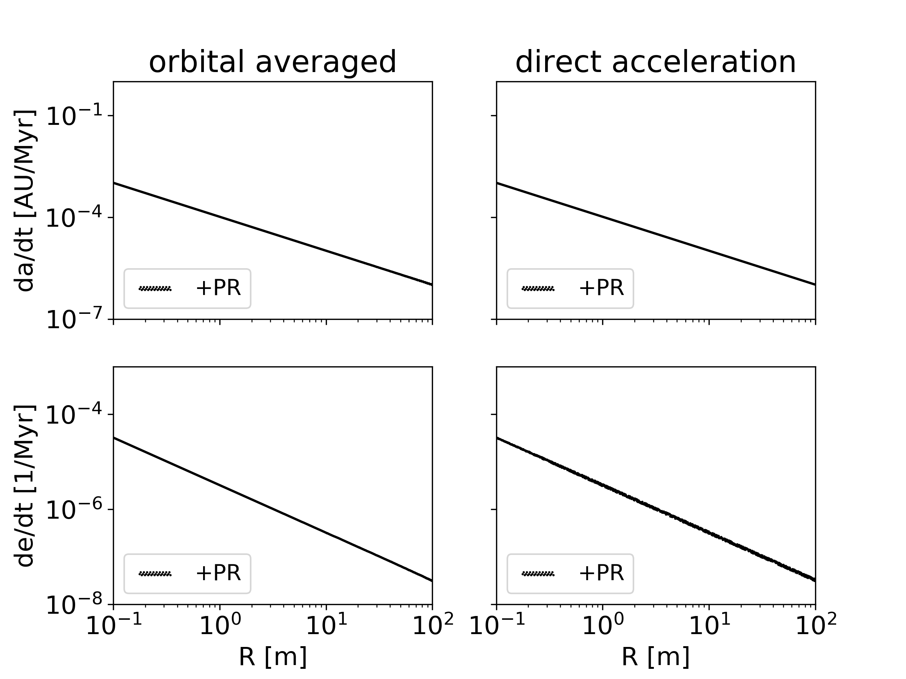

.. _PRdrag:

Poynting-Robertson effect
=========================

The Poynting-Robertson effect consists of the Poynting-Robertson drag and the radiation pressure force.
The Poynting-Robertson effect is implemented according to :cite:p:`Burns1979`
and is available in the schemes (we recommend scheme 1):

- | Velocity kick :math:`\mathbf{a_{PR}}`
  | set :literal:`Use Poynting-Robertson = 1` in the :ref:`param.dat<ParamFile>` file.
  | See Equation :eq:`eq_3a` and :eq:`eq_3b`
- | Orbital averaged change in sami-major axis and eccentricity :math:`\frac{da}{dt}`, :math:`\frac{de}{dt}`
  | set :literal:`Use Poynting-Robertson = 2` in the :ref:`param.dat<ParamFile>` file.
  | See Equation :eq:`eq_4`
	

The following parameters are relevant for the Poynting-Robertson effect and can be set in the :ref:`param.dat<ParamFile>` file:

- :literal:`Use Poynting-Robertson`
- :literal:`Solar Constant`: Solar Constant at 1 AU in W /m^2
- :literal:`Radiation Pressure Coefficient Qpr` (in general assumed to be 1)

.. _SolarWind:

Solar Wind
----------

Solar wind drag can be added to the Poynting-Robertson effect according to :cite:p:`LiouZookJackson1995`.
The solar wind drag is only applied in scheme 1. Enable it with:

- :literal:`Solar Wind factor`, only applied to scheme 1.

Scheme 1: Velocity kick
-----------------------

The Poynting-Robertson effect is implemented according to the following equation:

.. math::
   :label: eq_4

   \frac{d \mathbf{v}}{dt} = \frac{\eta c}{r^2} Q_{pr} \left[ \left(1 - \frac{\dot{r}}{c} \right) \hat{r} - \frac{\mathbf{v}}{c} \right].

When solar wind is included, then the following equation is used:

.. math::
   :label: eq_4b

   \frac{d \mathbf{v}}{dt} = \frac{\eta c}{r^2} Q_{pr} \left[ \left(1 - (1 + sw)\frac{\dot{r}}{c} \right) \hat{r} - (1 + sw)\frac{\mathbf{v}}{c} \right].

where :math:`sw` is the ratio of solar wind drag to Poynting-Robertson drag.

Scheme 2: orbital averaged drift rates
--------------------------------------
.. math::
   :label: eq_3a

   \frac{da}{dt} = -\frac{\eta}{a}Q_{pr} \frac{(2 + 3e^2)}{(1 - e^2)^{3/2}}

.. math::
   :label: eq_3b

   \frac{de}{dt} = - \frac{5}{2}\frac{\eta}{a^2}Q_{pr} \frac{e}{(1 - e^2)^{1/2}},

Test of the Poynting-Robertson effect
-------------------------------------

In :numref:`figPRdrag` is shown a test of the Poynting-Robertson effect for the same initial conditions as in 
:ref:`YarkovskyTest`, but with eccentricities :math:`\neq` 0. 

| Relevant parameters for this example:

-  Use Poynting-Robertson = 1 (2)
-  Solar Constant = 1367
-  Radiation Pressure Coefficient Qpr = 1

| Initial conditions:

- Semi-major axis a = 2 AU
- Eccentricity = 0.05
- Inclination = 0
- Argument of perihelion = 0 - 2 :math:`\pi`
- Longitude of ascending node = 0 - 2 :math:`\pi`
- Mean anomaly = 0 - 2 :math:`\pi`
- Density :math:`\rho` = 3500.0 kg/m^3
- Physical radius R =  0.1 - 100 m

   Drift rate of the Poynting-Robertson effect. Computed after 10000 years and averaged over 1 orbit.

