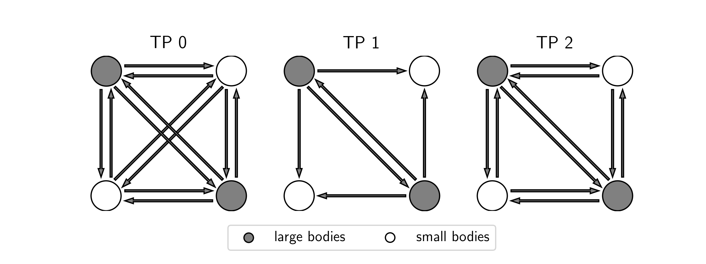
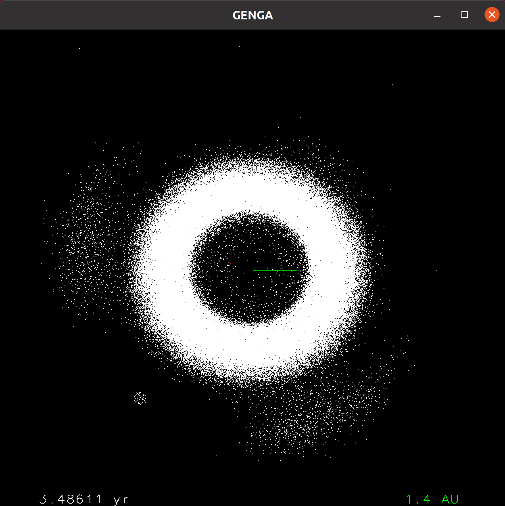

Running GENGA
=============

Starting GENGA
--------------

Before running GENGA, an initial conditions file must be provided, as described in :ref:`InitialConditions`.
An example of an initial conditions file with 2048 planetesimals is provided in the GENGA repository (initialplanet_2048.dat).

All relevant user parameters can be set in the :ref:`param.dat<ParamFile>` file, as described in :ref:`ParamFile`.
An example is also provided in the source directory.

GENGA can be started with::

    ./genga [options]

where :literal:`[options]` are optional user parameters as described in :ref:`ConsoleArguments`.

When GENGA is started again in the same directory, then all files are overwritten with the new simulation data.
To prevent GENGA from overwriting data, the lock.file option can be used (See :ref:`IgnoreLockFile`).

CPU version
^^^^^^^^^^^

When the CPU version of GENGA is used (See :ref:`gengaCPU`) then GENGA can be started with::

    ./gengaCPU [options]

A relevant option for multicore CPU runs is :literal:`-Nomp`, where the number of CPU cores can be set. 

Note that the CPU version of GENGA does not support the Multisimulation mode. In this case every sub-simulation should
just be run as an independent full simulation.

.. _Restart:

Restarting GENGA to continue simulations
----------------------------------------

A simulation can be restarted from each coordinate output file by using the :literal:`-R` time step console argument or by setting
a restart time in the :ref:`param.dat<ParamFile>` file. Before restarting a simulation things in the :ref:`param.dat<ParamFile>` file can be changed if necessary,
but the Output name must be the same as in the original run. To be able to restart a simulation, the corresponding coordinate output file,
the corresponding line in the energy file and the time file, and if used, the corresponding aeGrid file, must exist.
Note that the data in the Energy-, Collisions-, Ejections-, time- and info-files are not deleted and the new data is added at the end of these files.
But the coordinate output files are OVERWRITTEN with the new data. By restarting a simulation the values of E0 and the inner Energy are read from
the original run and are reused.
One can also use a coordinate output file to start a new simulation run with totally different parameters by using the Output file as a new initial
condition file. The :literal:`Input file Format` should then be of the form::

	<< t i m r x y z vx vy vz Sx Sy Sz amin amax emin emax - - - - >>

When GENGA is restarted using the console argument "-R", it changes the entry of the Lock file named lock.dat. This file must be deleted or modified
when GENGA is restarted again from the same time step. This prevents from data loss by an accidental relaunch. To ignore the lock file, the
:literal:`IgnoreLockFile` flag in the :ref:`define.h<Define>` file can be set to 1.

With the restart time -1, GENGA searches automatically for the last output and restarts directly from there. To determine the last output, the last entry
in the time file is used.

Interrupting a simulation
-------------------------

GENGA can be interrupted with the SIGINT signal (**Ctrl-C**, kill -2). In this case, GENGA completes the current time step and writes an additional last output.
With the restart time step -1, GENGA will continue the integration starting from this output. The SIGINT signal can also be sent to GENGA when using
a queuing system.

With SLURM, use ``#SBATCH --signal=INT@60`` in the sbatch file.

For example ::

	#!/bin/bash
	#SBATCH -J gengatest
	#SBATCH -n 1 --gres gpu:1 -p tasna
	#SBATCH --time 1-0
	#SBATCH --signal=INT@60

	srun genga -R -1

This will send the SIGINT signal 60 seconds before the end of the wall time to slurm. That allows GENGA to safe to current time step and write it into the
file, before the slurm job is terminated.

Note that the ``srun`` command must be used for slurm to work properly. 

When a slurm job must be stopped manually, the same behaviour can be achieved with::

	scancel --signal SIGINT <jobID>

Other kill signals e.g SIGKILL (kill -9) or SIGTERM (kill -15) will terminate GENGA immediately, and no last output is written.

.. _TestParticles:

Using test particles
--------------------
The default mode of GENGA computes the gravitational force between all pairs of particles, which leads to :math:`N^2` force calculations.
When :math:`N` is large, then this operation is the dominant part of the entire run time. 

When small particles are used in a simulation, then it can be useful to reduce the amount of mutual force calculations between small particles. 
This can be done with the test particle mode option :literal:`Use Test Particles` in the :ref:`param.dat<ParamFile>` file, or by using the
console argument :literal:`-TP 1` or :literal:`-TP 2`.

Test particles are bodies which have a smaller or equal mass than the value specified in the :literal:`Particle Minimum Mass` parameter. 

GENGA supports two different test particles modes, which are described below and visualized in :numref:`figTestParticles`

Test particles mode 1
^^^^^^^^^^^^^^^^^^^^^

:literal:`Use Test Particles = 1`
Small particles (with a mass smaller than :literal:`Particle Minimum Mass`, do not interact with other particles (small and large).
Large particles interact with all other large particles, and affect small particles. 
Small particles can collide with large bodies, but they do not perturb them gravitationally. 

Test particles mode 2 (semi active)
^^^^^^^^^^^^^^^^^^^^^^^^^^^^^^^^^^^
Small particles (with a mass smaller than :literal:`Particle Minimum Mass`, do not interact with other small particles.
Small particles interact with all large particles.
Large particles interact with all large and small particles.

   Calculated force terms of the different test particles modes, (0, 1 and 2) for an example of two large and two small particles

Multi simulation mode
---------------------
The multi simulation mode can be used to simulate a large number of small simulations with up to 32 massive particles.
Individual sub simulations can have a different number of bodies.
For each simulation a new directory is needed, containing the initial condition file and the :ref:`param.dat<ParamFile>` file.
Note that not all parameters in the :ref:`param.dat<ParamFile>` file can be chosen individually, these are only:

- the time step
- the number of integration steps
- the name
- the central mass
- the star radius
- the star Love number
- the star fluid Love number
- the star tau
- the star spin_x
- the star spin_y
- the star spin_z
- the star Ic
- the n1 parameter
- the n2 parameter
- the initial condition file
- the default rho
- the Minimum number of bodies number
- the Minimum number of test particles number
- the inner truncation radius
- the outer truncation radius

All the other parameters are read from the simulation number 0.
To start a multi simulation run, an additional file is needed, which contains a list of all sub simulation directory names.

For example a file named :literal:`path.dat`::

	sim0000
	sim0001
	sim0002
	.
	.
	.

The simulation can then be started with::

	 ./genga [options] -M path.dat

where :literal:`[options]` are optional user parameters as described in :ref:`ConsoleArguments`.

If a sub simulation contains less particles than specified in the :literal:`Minimum number of bodies` or the :literal:`Minimum number of test particles`
number, then this specific simulation is stopped and the total number of simulations is reduced.

In the multi simulation mode, the indexes of the particles should not be greater than 100.

.. _KE:

Generate Keplerian-elements output files 
----------------------------------------
Output files can be converted into Keplerian-elements output files with the :literal:`KE` tool, located in the :literal:`tools` directory.

Compile with typing:: 

        make

into a terminal.

Then run :literal:`KE` with::

    ./KE [options]

where :literal:`[options]` are the following optional user parameters:

- :literal:`-tmin`: starting time step, (used for FormatT = 0, FormatP = 1).
- :literal:`-tmax`: ending time step ,(used for FormatT = 0, FormatP = 1).
- :literal:`-step`: output interval, (used for FormatT = 0, FormatP = 1).
- :literal:`-pmin`: starting particle index, (used for FormatT = 1, FormatP = 0).
- :literal:`-pmax`: ending particle index, (used for FormatT = 1, FormatP = 0).
- :literal:`-in`: name of the files
- :literal:`-Msun`: Solar Mass (default = 1.0 :math:`M_\odot`)

Alternative to the console options, a parameter file called :literal:`paramKE.dat` can be used. This file contains the following arguments:

- :literal:`Output name`: name of the files
- :literal:`-tmin`: starting time step, (used for FormatT = 0, FormatP = 1).
- :literal:`-tmax`: ending time step ,(used for FormatT = 0, FormatP = 1).
- :literal:`-step`: output interval, (used for FormatT = 0, FormatP = 1).
- :literal:`-pmin`: starting particle index, (used for FormatT = 1, FormatP = 0).
- :literal:`-pmax`: ending particle index, (used for FormatT = 1, FormatP = 0).
- :literal:`-Central Mass`: Solar Mass (default = 1.0 :math:`M_\odot`)
- :literal:`Output file Format:` This must correspond to the entry of the GENGA :literal:`param.dat` file.

The KE tool generates for each coordinate output file a corresponding Kepler-Elements file, see :ref:`aeiFiles`.
 
Example for FormatT = 0, FormatP = 1 (default)::

    ./KE -tmin 0 -tmax 1000 -step 10 -in test

This example will generate Kepler-Element files from timestep 0 to 1000 in output intervals of 10 for a simulation name 'test'.

Example for FormatT = 1, FormatP = 0::

    ./KE -pmin 0 -pmax 2048 -in test

This example will generate Kepler-Element files from particle index 0 to 2048 for a simulation name 'test'.

.. _HelioToBary:

Convert output files to barycentric coordinates
-----------------------------------------------
Heliocentric output files can be converted into barycentric output files with the :literal:`ConvertHelioToBarry` tool, located in the :literal:`tools` directory.

This tool works only in the output format, FormatT = 0, FormatP = 1. If a different output format is uses, then the conversion tools should be used to convert before and after this step (:ref:`P1T0_to_P0T1` and :ref:`P0T1_to_P1T0`).

Compile with typing:: 

        make

into a terminal.

Then run :literal:`ConvertHelioToBarry` with::

    ./ConvertHelioToBarry [options]

where :literal:`[options]` are the following optional user parameters:

- :literal:`-tmin`: starting time step, (used for FormatT = 0, FormatP = 1).
- :literal:`-tmax`: ending time step ,(used for FormatT = 0, FormatP = 1).
- :literal:`-step`: output interval, (used for FormatT = 0, FormatP = 1).
- :literal:`-in`: name of the files
- :literal:`-Msun`: Solar Mass (default = 1.0 :math:`M_\odot`)

The ConvertHelioToBarry tool generates for each coordinate output file a corresponding barycentric output file, see :ref:`baryFiles`.
 
Example::

    ./ConvertHelioToBarry -tmin 0 -tmax 1000 -step 10 -in test

This example will generate barycentric output files from timestep 0 to 1000 in output intervals of 10 for a simulation name 'test'.

.. _P0T1_to_P1T0:

Convert_P0T1_to_P1T0
--------------------

This tool converts GENGA outputs from FormatP = 0 & FormatT = 1, to FormatP = 1 & FormatT = 0.

Compile with typing::

        make

into a terminal.

Then run :literal:`Convert_P0T1_to_P1T0` with::

    ./Convert_P0T1_to_P1T0 [options]

where :literal:`[options]` are the following optional user parameters:

- :literal:`-pmin`: starting particle index.
- :literal:`-pmax`: ending particle index.
- :literal:`-in`: name of the files
- :literal:`-dt`: time step in days (default = 6.0 days)
- :literal:`-t`: Start time of the simulation in years (default = 0) 

Example::

    ./Convert_P0T1_to_P1T0 -pim 0 -pmax 1000 -in test -dt 6 -t 0

This example will generate output files containing all particles with indices between 0 and 1000, for a simulation name 'test' and a used time
step of 6 days and a starting time of the simulation of 0 years.

.. _P1T0_to_P0T1:

Convert_P1T0_to_P0T1
--------------------

This tool converts GENGA outputs from FormatP = 1 & FormatT = 0, to FormatP = 0 & FormatT = 1.

Compile with typing::

        make

into a terminal.

Then run :literal:`Convert_P1T0_to_P0T1` with::

    ./Convert_P1T0_to_P0T1 [options]

where :literal:`[options]` are the following optional user parameters:

- :literal:`-tmin`: starting time step.
- :literal:`-tmax`: ending time step.
- :literal:`-step`: output interval.
- :literal:`-in`: name of the files

Example::

    ./Convert_P1T0_to_P0T1 -tim 0 -tmax 1000 -step 10 -in test

This example will generate output files containing all particles between the time steps 0 and 1000 with a time step output interval of 10 
and a simulation name 'test'.

.. _cleanTime:

Cleaning the time files
-----------------------

The time file contains the time in seconds, GENGA needed to reach the next coordinate interval. When the
code was interrupted in between of two output intervals, then the time file contains additional lines with
the divided times in it. If the code was interrupted many times due to e.g. limited wall times, the time files
can get hard to read. 

The tool :literal:`cleanTime.py` in the :literal:`tools` directory can be used to clean the time files and
add the divided times together to the original coordinate output intervals. 

The tool can be used with::

    python3 cleanTime.py -n <name> -ci <I>

where <name> is the name in the simulation files, and <I> is the coordinate output interval used in the 
param.dat file. 

The tool will create a new file :literal:`timeClean<name>.dat` with the cleaned times. 

.. _IrregularOutput:

Irregular output times
----------------------
When output data is needed on an irregular interval, then the :literal:`Coordinates output interval` and :literal:`Energy output interval`
parameters are not useful. Instead a calendar file with the desired output times can be provided. The name of this file must be set in the
:literal:`Irregular output calendar` parameter in the :ref:`param.dat<ParamFile>` file.

The file must contain line by line the times of the desired outputs in units of years. At each irregular output time,
and entry in the irregular energy file is written, and a new irregular output file is created (:ref:`IrrOutFile` and :ref:`IrrEnergyFile`).
 

For example, a calendar file containing the following lines::

	0.1
	0.11
	0.3 

creates three irregular output files OutIrrtest_000000000000.dat, OutIrrtest_000000000001.dat and OutIrrtest_000000000002.dat.

When starting a new simulation, then old OutIrr<name>.dat files and EnergyIrr<name>.dat files are not deleted. If the EnergyIrr<name>.dat file already exists, then the initial energy for a new simulation is read from this file.

When the multi simulation mode is used, then the time and time-step information is only read from the first sub-simulation and applied to all simulations synchronously.

The number of digits in the output filenames can be changed with the :literal:`def_NFileNameDigits` parameter in the :ref:`define.h<Define>` file

.. _tuning:

Use self tuning kernel parameters
---------------------------------

GPU kernels need to be configured with kernel parameters. These are the number of threads per threadblock and the number of threadblocks.
The performance of a GPU code can depend on the specified parameters. Also depending on the used initial conditions and the used GPU type,
the best choice of the kernel parameters can be different. 
Therefore GENGA uses a self tuning routine to determine the best choice at the beginning of the simulations. The used parameters
are reported in :ref:`tuningFile`. If the tuning routine is not enabled, then this file can be used to set the parameters.
If the file does not exist and if the tuning routine is enabled, then default values are used for the parameters.

If :ref:`SerialGrouping` is used, then always the default values are used. The reason is that a different choice of kernel parameters
can lead to a different rounding error array summations. 

When the performance of GENGA measured with a profiling tool (e.g nvprof or nsys) then, GENGA should be run first with the tuning routine
enabled, to write the :ref:`tuningFile`. And in a second step, the profiling can be done without the tuning routine. The reason for this
is that the tuning routine is running some kernels many times, which affects the profiling statistics. 

The tuning routine can be enabled with the :literal:`Do kernel tuning` parameter in the :ref:`param.dat<ParamFile>` file.

.. _GengaGL:

GengaGL: Real time visualization with openGL
--------------------------------------------

GENGA offers the option to view a real time visualization of a simulation by using openGL. Thi option can only be used with a GPU that is 
connected directly to the monitor. Typically, GPUs in a computer cluster can not be used for this. GENGA uses the CUDA openGL interoperability 
to visualize the simulated particle directly with the GPU. No data transfer to the CPU is needed, therefore only very little extra run time is
added to the simulation. 

To compile GENGA with openGL, GLUT must be installed. In Ubuntu this can be installed with the freeglut3-dev package::

	sudo apt install freeglut3-dev
 

The GENGA - openGL interoperability code is included in the GengaGL directory and can be compiled with the provided Makefile in the same way as
the original GENGA code.

GengaGL can be started with::

	./gengaGL [options]

where :literal:`[options]` are optional user parameters as described in :ref:`ConsoleArguments`.

When GengaGL is started, then a window with the visualization is created.
At the origin, the axis of the coordinate system is plotted.
On the bottom left, the time of the integration is shown. On the bottom right, the scale of the coordinate system axis is indicated.
The color of the particles correspond to the masses of the bodies. Red indicates the largest masses, yellow the smallest masses.
Massless particles are plotted in white color. 

The following options can be used to interact with the visualization:

- Left click and move the mouse to rotate around the z-axis and the y-axis.
- Right click and move the mouse up or down to change the rotation speed of the reference frame.
- Press 'a' + left click and move the mouse to shift the origin.
- Press space, 'p' or middle click to pause the simulation. Press again to continue.
- Use the scroll option to zoom in and out of the visualization.
- Press 'r' to increase the point size of the particles.
- press 't' to decrease the point size of the particles.
- Press 'o' to reset to the original visualization settings.

In :numref:`figGengaGL` is shown a screenshot of GengaGL.

   Screenshot of the GENGA real time visualization tool using openGL. Shown is the inner part of the Solar System, including
   Jupiter and the asteroid belt. The Trojans are nicely visible on the Lagrange points of Jupiter.
