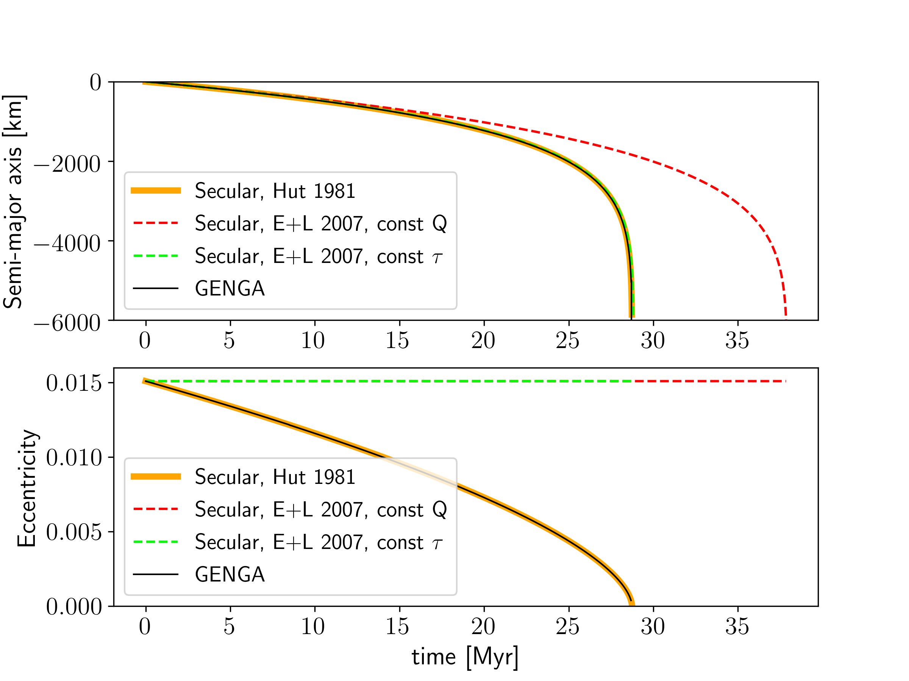

.. _Tides:

Tidal Forces
============

Tidal Forces can be enabled with the :literal:`Use Tides` parameter in the :literal:`param.dat` file.
The tidal forces evolve the spin of the particles and spin of the central star. The evolution of the
stellar spin is reported in :ref:`StarFile`.

Parameters for the tidal forces:

 - :literal:`Star Love Number`
 - :literal:`Star tau`
 - :literal:`Star spin_x`
 - :literal:`Star spin_y`
 - :literal:`Star spin_z`
 - :literal:`Star Ic`

and the initial conditions:

 - k2
 - tau
 - Sx
 - Sy
 - Sz
 - Ic

For implementing the tidal effects, we follow the weak friction tidal model described in :cite:p:`Hut1981` and  :cite:p:`Bolmont2015`.
In this model, the tidal bulge of a primary body with radius :math:`R`, induced by a companion body of mass :math:`m`, is described by
two point masses at the surface of the primary body with mass :cite:p:`Hut1981` 

.. math:: 

    \mu \approx \frac{1}{2} k_{2,i} m R^3 \left[r(t - \tau) \right] ^{-3},

where :math:`r(t - \tau)` is the distance between the two bodies at time :math:`t - \tau`, and :math:`\tau` is a constant time lag,
which models the tidal dissipation. :math:`k_{2,i}` is the potential Love number of degree 2 of the body :math:`i`. 

The tidal force can be written as:

.. math::

   \mathbf{F}_T = \left[- (D_{t0,\star} + D_{t0,i}) -2\frac{\dot{r}_i}{r_i}  (P_{t0,\star} + P_{t0,i})\right] \mathbf{e}_{ri} \\ \nonumber
   + P_{t0,i} \left(\mathbf{\Omega}_i \times \mathbf{e}_{ri} \right) +  P_{t0,\star} \left(\mathbf{\Omega}_{\star} \times \mathbf{e}_{ri} \right) \\ \nonumber
   - \left(P_{t0,i} +  P_{t0,\star} \right) \frac{\mathbf{v}_i}{r_i}.

with the  quantities: 

.. math:: 

   D_{t0,i} = 3G\frac{m^2_{\star}R^5_i}{r^7_i} k_{2,i} \\
   D_{t0,\star} = 3G\frac{m^2_i R^5_\star}{r^7_i} k_{2,\star}

and 

.. math::

   P_{t0,i} = D_{t0,i} \tau_i \\
   P_{t0,\star} = D_{t0,\star} \tau_{\star}.

where :math:`\mathbf{e}_{ri}` is the radial unit vector, and :math:`\mathbf{\Omega}_{\star}` is the rotational angular velocity vector of the star,
:math:`\mathbf{\Omega}_i` the rotational angular velocity vector of the body :math:`i`.

(See :ref:`UnitsSpin` to convert the rotational angular velocity into a spin.)

Since the equation :eq:`eq_apn` depends on the positions and the velocities, the GR corrections must by
applied with the implicit midpoint method. In that way the symplectic nature of the integration is conserved.

Tidal spin evolution
--------------------

Additionally to the acceleration on the particles, the tidal force generates a torque,  which changes the spin of
the particles and of the central star.

This tidal torque is given as 

.. math::

    \mathbf{N}_T = \mathbf{r} \times \mathbf{F}_{T\theta},

with the transverse component of the tidal force :math:`\mathbf{F}_{T\theta}`. 

With the relation

.. math::

    \mathbf{r} \times (\mathbf{\Omega} \times \mathbf{e}_r) - \mathbf{r} \times \frac{\mathbf{v}}{r} = 
    \mathbf{\Omega}r - (\mathbf{r} \cdot \mathbf{\Omega}) \mathbf{e}_r - \mathbf{e}_r \times \mathbf{v},

the tidal torque can be written as:

.. math::

    \mathbf{N}_{Ti} = P_{to,i} \left[ \mathbf{\Omega}_i r_i - (\mathbf{r}_i \cdot \mathbf{\Omega}_i) \mathbf{e}_{ri} - \mathbf{e}_{ri} \times \mathbf{v}_i \right]

.. math::

    \mathbf{N}_{T\star} = P_{to,\star} \left[ \mathbf{\Omega}_\star ri - (\mathbf{r}_i \cdot \mathbf{\Omega}_\star) \mathbf{e}_{ri} - \mathbf{e}_{ri} \times \mathbf{v}_i \right]

By using heliocentric coordinates, the spin evolution is takes the form :cite:p:`Bolmont2015`

.. math::

    \frac{d}{dt} (I_\star \mathbf{\Omega}_\star) = - \sum_{j=1}^N \frac{m_\star}{m_\star + m_j} \mathbf{N}_{T\star}

and

.. math::

    \frac{d}{dt} (I_i \mathbf{\Omega}_i) = - \frac{m_\star}{m_\star + m_i} \mathbf{N}_{Ti},

with the moment of inertia :math:`I`.

Test and comparison
-------------------
To test the implementation of the tidal forces,
we repeat the calculations of the Mars-Phobos system, described, in :cite:p:`EfroimskyLainey2007` and :cite:p:`Auclair-Desrotour+2014`. 
As initial values, we use the same parameters as given in Table 1 in :cite:p:`Auclair-Desrotour+2014`. Additionally, we use an eccentricity of 0.0151. 

    Comparison of GENGA against secular evolution models on the example of the Mars-Phobos system. The models correspond to
    :cite:p:`Hut1981` (blue solid line), [Equation 30] :cite:p:`EfroimskyLainey2007` (red dashed line) and  [Equation 36] :cite:p:`EfroimskyLainey2007`
    (green dashed line). The evolution of the semi-major axis and the eccentricity in GENGA agree well with the constant :math:`\tau`
    scenario in the secular evolution models.
    This plot reproduces the results of Figure 2 from :cite:p:`EfroimskyLainey2007`.

