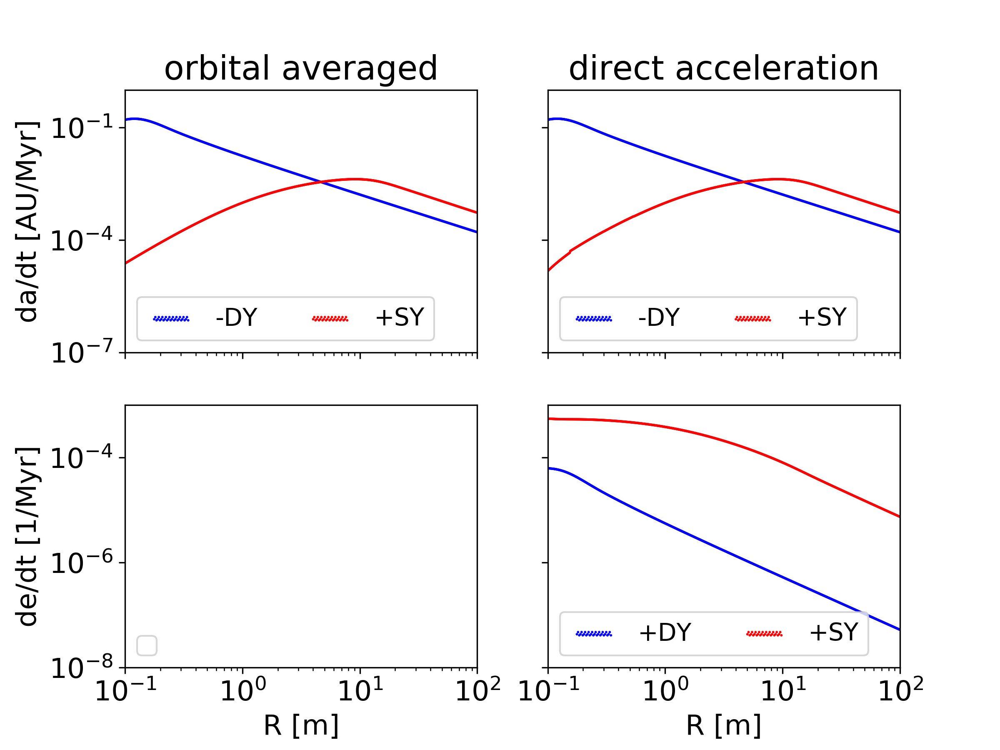

.. _Yarkovsky:

Yarkovsky effect
================

The Yarkovky effect is implemented according to :cite:p:`Vokrouhlicky1999` and :cite:p:`Vokrouhlicky2000`
and is available in the schemes (we recommend scheme 1):

- | Velocity kick :math:`\mathbf{a_Y}`
  | set :literal:`Use Yarkovsky = 1` in the :ref:`param.dat<ParamFile>` file.
  | See Equation :eq:`eq_1a` and :eq:`eq_1b`
- | Time averaged change in sami-major axis :math:`\frac{da}{dt}`
  | set :literal:`Use Yarkovsky = 2` in the :ref:`param.dat<ParamFile>` file.
  | See Equation :eq:`eq_2a` and :eq:`eq_2b`
	

| The following parameters are relevant for the Yarkovsky effect and can be set in the :ref:`param.dat<ParamFile>` file:

- :literal:`Use Yarkovsky`
- :literal:`Solar Constant`: Solar Constant at 1 AU in W / :math:`\text{m}^2`
- :literal:`Asteroid eps`: Emissivity factor
- :literal:`Asteroid rho`: density of the body in kg/ :math:`\text{m}^3`
- :literal:`Asteroid C`: Specific Heat Capacity in :math:`\text{J} \, \text{kg}^{-1} \text{K}^{-1}`
- :literal:`Asteroid A`: Bond albedo
- :literal:`Asteroid K`: Thermal conductivity in :math:`\text{W} \, \text{m}^{-1} \text{K}^{-1}`

Note that the calculation of the Yarkovsky effect uses the :literal:`Asteroid rho` value for the calculation of the thermal intertia
:math:`\Gamma` and not the individual particle densities.

.. math::
   :label: eq_1a

   \mathbf{a}_{seasonal} = \frac{4}{9}\frac{(1 - A) \Phi}{(1 + \lambda)} \times \sum_{k \ge 1} G_k\left[s_P \alpha _k \cos (knt + \delta_k) + s_Q \beta_k \sin(knt + \delta_k) \right] \mathbf{s}, 

.. math::
   :label: eq_1b

   \mathbf{a}_{diurnal} = \frac{4}{9}\frac{(1 - A) \Phi}{(1 + \lambda)} G\left[\sin \delta + \cos \delta \mathbf{s} \times \right] \frac{\mathbf{r} \times \mathbf{s}}{r}.

.. math::
   :label: eq_2a

   \left(\frac{da}{dt} \right)_{diurnal} = - \frac{8}{9} \frac{(1-A)\Phi}{n} \frac{G \sin \delta}{1 + \lambda} \cos \gamma

.. math::
   :label: eq_2b

   \left(\frac{da}{dt} \right)_{seasonal} = \frac{4}{9} \frac{(1-A)\Phi}{n} \sum_{k \ge 1} \frac{G_k \sin \delta_k}{k} \chi_k \bar{\chi_k},

.. _YarkovskyTest:

Test of the Yarkovsky effet
---------------------------

In :numref:`figYarkovsky` is shown a test of the Yarkovsky effect following :cite:p:`Farinella1998` and :cite:p:`Bottke2000`. 

| Relevant parameters for this example:

-  Use Yarkovsky = 1 (2)
-  Asteroid emissivity eps = 1.0
-  Asteroid density rho = 3500.0
-  Asteroid specific heat capacity C = 680.0
-  Asteroid albedo A = 0.0
-  Asteroid thermal conductivity K = 2.65
-  Solar Constant = 1367

| Initial conditions:

- Semi-major axis a = 2 AU
- Eccentricity = 0
- Inclination = 0
- Argument of perihelion = 0 - 2 :math:`\pi`
- Longitude of ascending node = 0 - 2 :math:`\pi`
- Mean anomaly = 0 - 2 :math:`\pi`
- Density :math:`\rho` = 3500.0 kg/m^3
- Physical radius R =  0.1 - 100 m
- Rotation frequency :math:`\omega` = 5 h
- Obliquity :math:`\gamma_{\text{Seasonal}}`  =  :math:`90^\circ`
- Obliquity :math:`\gamma_{\text{Diurnal}}`  =  0

   Drift rate of the seasonal and diurnal Yarkovsky effect. Computed after 10000 years and averaged over 1 orbit.

