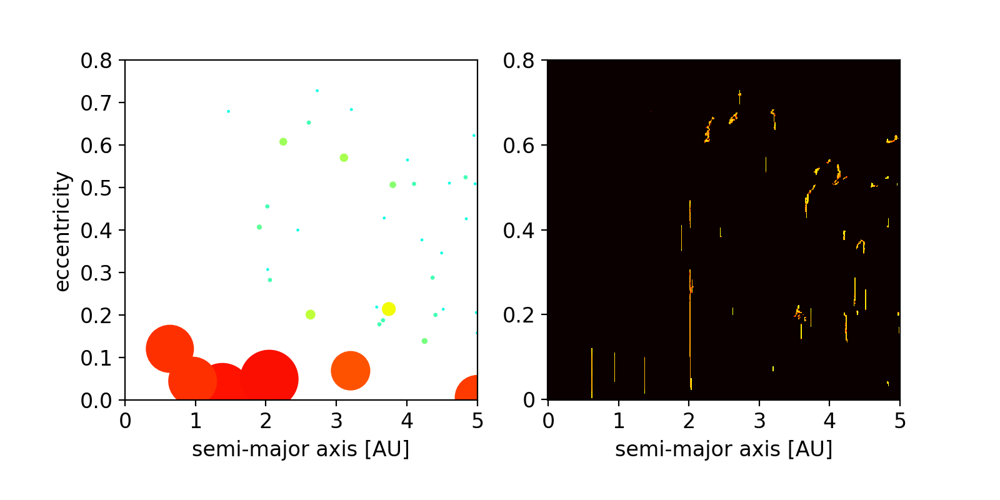
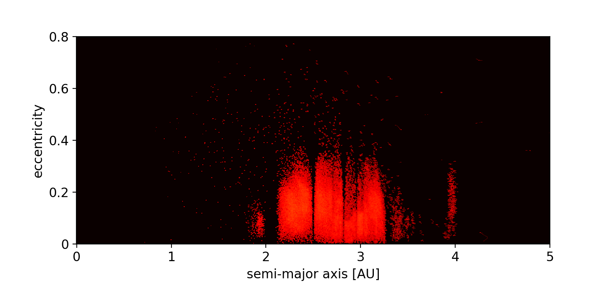

.. _aeLimits:

aeLimits
========

The aeLimits can be used to check how much time a specific body spends in a given range in semi-major axis and eccentricity. The limits of this range can be set with the
:literal:`amin`, :literal:`amax`, :literal:`emin` and :literal:`emax` parameters in the initial condition file. When the corresponding particle spends time in the given
range in a-e space, then a counter is increased. The values of the counter is included in :ref:`OutFile`.
These values can be useful in a stability analysis of planetary systems. 

.. _aegrid:

The a-e and a-i grid
====================

The a-e (semi-major axis - eccentricity) and a-i (semi-major axis - inclination)  grids can be used to keep track of the coordinates of bodies at each time step, also
in between of the specified coordinate output intervals. These grids count at every time step the number
of particles in each cell. This option offers to possibility to keep track of small scale movements of
particles without having to write too many output files.

The dimensions and resolutions of the grid can be specified by the following user parameters:

- :literal:`Use aeGrid`, flag to enable the a-e and a-i grids, (default = 0)
- :literal:`aeGrid amin`, minimal value of the same-major axis dimension, in AU.
- :literal:`aeGrid amax`, maximal value of the same-major axis dimension, in AU.
- :literal:`aeGrid emin`, minimal value of the eccentricity dimension.
- :literal:`aeGrid emax`, maximal value of the eccentricity dimension.
- :literal:`aeGrid imin`, minimal value of the inclination dimension, in radians.
- :literal:`aeGrid imax`, maximal value of the inclination dimension, in radians.
- :literal:`aeGrid Na`, number of points in the same-major axis dimension.
- :literal:`aeGrid Ne`, number of points in the eccentricity dimension.
- :literal:`aeGrid Ni`, number of points in the inclination dimension.
- :literal:`aeGrid Start Count`, starting time step when a-e and a-i grid start, in units of time steps
- :literal:`aeGrid name`, name of the grid files.

The a-e and a-i grid consist both of two parts, the first grid counts the number of particles per cell
since the last coordinate output time, and the second grid counts the overall number since the beginning
of the simulations.
At each coordinate output time, alsoe the a-e and a-i grid data is transferred to the CPU und written
to the files :ref:`aeCountFile`.

When using the multi simulation mode, then all simulations contribute to the same grid.

In :numref:`figaeCount` is shown an example of an a-e grid with the following parameters::

	Use aeGrid = 1
	aeGrid amin = 0
	aeGrid amax = 5
	aeGrid emin = 0
	aeGrid emax = 0.8
	aeGrid imin = 0
	aeGrid imax = 0.8
	aeGrid Na = 400
	aeGrid Ne = 400
	aeGrid Ni = 400 

   Left panel: a snapshot of a planet formation simulation with six formed terrestrial planets (shown in red color)
   and some leftover planetesimals (shown in blue and green colors).

   Right panel: The a-e grid of the same time step includes all positions since the last output time and visualizes
   the movement of individual bodies.

In :numref:`figaeCountS` is shown another example of an a-e grid, by integrating the Solar System.

   a-e grid of the Solar System, including asteroids as test particles.
 
